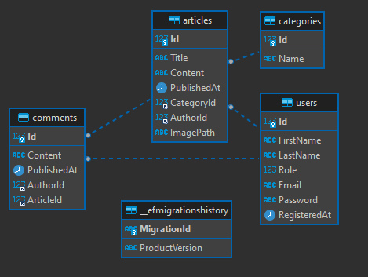

# Newspoint

Newspoint je ukázková aplikace pro správu zpravodajského obsahu (články, kategorie, komentáře, uživatelé a role).

## Struktura řešení

Repozitář je rozdělený na několik projektů:

- `Newspoint.Client` – frontend aplikace postavená na React + Vite
- `Newspoint.Server` – ASP.NET Core backend / API
- `Newspoint.Application` – aplikační logika, služby, validace
- `Newspoint.Domain` – doménové entity
- `Newspoint.Infrastructure` – přístup k databázi, migrace, implementace repozitářů
- `Newspoint.Tests` – testy aplikace

## Funkční přehled

### 1. Uživatelská autentizace a autorizace

**Registrace uživatele**

- Uživatel se může registrovat pomocí e-mailu a hesla.
- Heslo musí být bezpečně uloženo (hash).

**Přihlášení**

- Uživatel se přihlásí pomocí e-mailu a hesla.

**Role**

- Standardní role: `Admin`, `Redaktor`, `Čtenář`.
- Role ovlivňuje oprávnění pro vytváření, úpravu a mazání článků.

### 2. Správa článků

**Vytvoření článku**

- `Redaktor` nebo `Admin` může vytvořit nový článek s následujícími informacemi:
  - Titulek
  - Obsah (text)
  - Autor
  - Kategorie (např. politika, sport, kultura)
  - Datum publikace

**Úprava článku**

- `Redaktor` nebo `Admin` může upravovat vlastní články.
- `Admin` může upravovat všechny články.

**Mazání článku**

- `Redaktor` může mazat vlastní články.
- `Admin` může mazat všechny články.

**Zobrazení článku**

- `Čtenář` i nepřihlášený uživatel může zobrazit seznam článků a detail článku.
- Možnost filtrovat podle kategorie nebo data publikace.

### 3. Komentáře

- Přihlášení uživatelé mohou přidávat komentáře k článkům.
- Uživatel může mazat vlastní komentáře.
- `Admin` může mazat všechny komentáře.
- Komentáře jsou zobrazovány chronologicky pod článkem.
- `Redaktor` může mazat komentáře pod svým článkem.

### 4. Vyhledávání a filtrování

**Vyhledávání článků podle:**

- Titulku
- Obsahu
- Autora

**Filtrování podle:**

- Kategorie
- Autora
- Data publikace (nejnovější, nejstarší)

### 5. Správa uživatelů (admin)

`Admin` může:

- Zobrazit seznam uživatelů.
- Blokovat / odblokovat uživatele.
- Nastavovat role uživatelům.

### 6. Obecné požadavky

- Responsivní design pro desktop a mobil.
- Základní logování chyb na backendu.
- Základní error handling na frontend i backendu (notifikace uživateli).

## Databázové schéma

Databázové schéma je uloženo v podobě ER diagramu v souboru `schemadb.png` v rootu repozitáře.

### Přehled hlavních entit

- `User` – uživatelský účet, obsahuje přihlašovací údaje a profilové informace.
- `Role` – uživatelská role (např. čtenář, redaktor, editor, administrátor).
- `Article` – článek, který patří do jedné nebo více kategorií a má přiřazeného autora (`User`).
- `Category` – tematická kategorie článků.
- `Comment` – komentář k článku, navázaný na `User` a `Article`.

### Vztahy mezi entitami

- `User` 1–N `Article` – každý článek má jednoho autora, uživatel může napsat více článků.
- `Article` 1–N `Comment` – článek může mít více komentářů.
- `User` 1–N `Comment` – uživatel může napsat více komentářů.
- `Category` 1–N `Article` (případně M–N podle skutečné implementace) – články jsou zařazené do kategorií.
- `User` N–M `Role` – uživatel může mít více rolí, role může být přiřazena více uživatelům.

Detailní strukturu tabulek, klíčů a relací najdete v diagramu:

- 